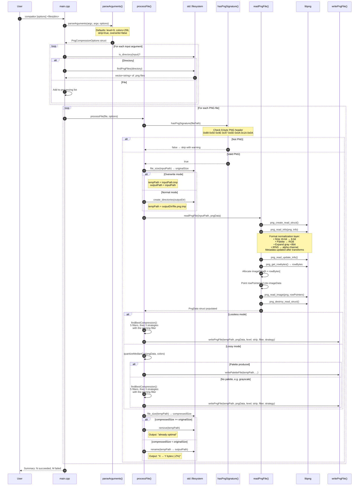
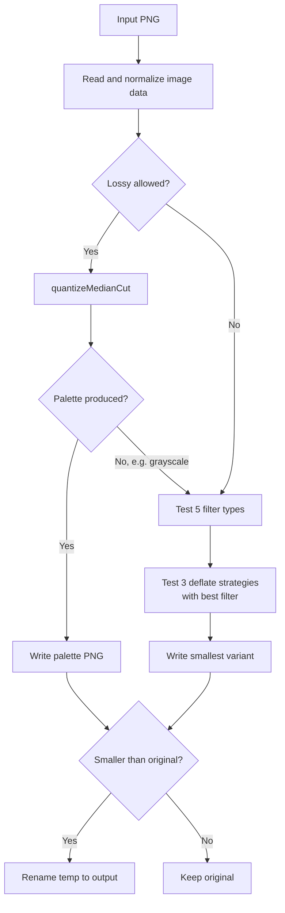

# compattor

PNG compression tool written in C++ using libpng. Uses median-cut color quantization to achieve high compression, and exhaustive filter/strategy search for lossless mode.

## Dependencies

### Build Requirements

| Dependency | Version | Purpose | Install (Arch) | Install (Debian/Ubuntu) |
|------------|---------|---------|----------------|-------------------------|
| C++ compiler | GCC 7+ or Clang 5+ | C++17 support | `pacman -S gcc` | `apt install g++` |
| libpng | 1.6+ | PNG reading/writing/compression | `pacman -S libpng` | `apt install libpng-dev` |
| pkg-config | any | Locate libpng flags | `pacman -S pkgconf` | `apt install pkg-config` |
| make | any | Build automation | `pacman -S make` | `apt install make` |

### Test Requirements

| Dependency | Version | Purpose | Install (Arch) | Install (Debian/Ubuntu) |
|------------|---------|---------|----------------|-------------------------|
| Google Test | 1.12+ | Unit testing framework | `pacman -S gtest` | `apt install libgtest-dev` |
| gcov | GCC bundled | Code coverage analysis | Included with GCC | Included with GCC |

### System Verification

```bash
# Check compiler
g++ --version

# Check libpng
pkg-config --cflags --libs libpng16

# Check Google Test
ls /usr/include/gtest/gtest.h
ls /usr/lib/libgtest*
```

## Build

```bash
make
```

Binary output: `build/compattor`

## Install

```bash
sudo make install
```

Installs to `/usr/local/bin/compattor`.

## Uninstall

```bash
sudo make uninstall
```

## Usage

```bash
# Single file (default: 256-color quantization + level 9)
compattor photo.png

# Lossless mode (no color reduction)
compattor --lossless photo.png

# Custom color count
compattor -c 128 photo.png

# Process entire directory
compattor ./images/

# Custom compression level
compattor -l 8 -o /tmp/output *.png

# Overwrite originals
compattor -w photo.png
```

## Options

| Flag | Long | Description |
|------|------|-------------|
| `-l` | `--level <1-9>` | Compression level (default: 9) |
| `-c` | `--colors <2-256>` | Number of colors for quantization (default: 256) |
| | `--lossless` | Disable lossy compression, use lossless only |
| `-s` | `--strip` | Remove PNG metadata (default: on) |
| `-o` | `--output <dir>` | Output directory (default: ./compressed) |
| `-w` | `--overwrite` | Overwrite original files in place |
| `-h` | `--help` | Show help message |

### Compression levels (`-l`)

| Level | Speed | Compression | Use Case |
|-------|-------|-------------|----------|
| 1 | Fastest | Light | Batch processing, quick preview |
| 2-6 | Medium | Good | General use |
| 7-9 | Slower | Maximum | Distribution, storage optimization |

### Precedence

Flags are applied in the order they appear; when the same flag repeats, the last value wins:

```
compattor -l 3 -l 8 photo.png   → level = 8
compattor -l 8 -l 3 photo.png   → level = 3
```

`--lossless` selects the compression mode, so `-c/--colors` has no effect when it is present.

## Compression Modes

### Lossy (default)

Uses frequency sampling plus median-cut clustering to reduce colors to a palette (256 colors by default), then writes with zlib level 9. Transparency is preserved: RGBA colors are quantized together with their alpha values and written as a palette with a `tRNS` chunk. Grayscale images fall back to lossless mode.

### Lossless (`--lossless`)

Tests 5 PNG filter types combined with 3 deflate strategies (default, filtered, RLE) and keeps the smallest output. No visual quality loss.

### Safety net

If the compressed output is not smaller than the original, the original is kept and the file is reported as "already optimal". Output files are written to a temporary path and renamed atomically.

## Tests

```bash
make test
```

## Code Coverage

```bash
make coverage
```

## Architecture



### Execution Flow Summary

| Step | Function | Library | Description |
|------|----------|---------|-------------|
| 1 | `parseArguments()` | C++ STL | Parse CLI flags with strict numeric validation |
| 2 | `findPngFiles()` | `std::filesystem` | Scan directory for `.png` extension |
| 3 | `processFile()` | libpng + zlib | Per-file pipeline: validate, read, compress, write |
| 4 | `hasPngSignature()` | C++ fstream | Validate 8-byte PNG magic number |
| 5 | `readPngFile()` | libpng | Read PNG, apply format normalization |
| 6 | `quantizeMedianCut()` | C++ STL | Reduce RGBA colors to a palette (lossy mode) |
| 7 | `findBestCompression()` | libpng + zlib | Search 5 filters, then 3 strategies with the winning filter |
| 8 | `writePaletteFile()` / `writePngFile()` | libpng + zlib | Write palette or filtered PNG |
| 9 | Size comparison | `std::filesystem` | Keep original if already optimal |

### Filter and Strategy Selection

compattor automatically tests 5 PNG filter types to find the best compression:

| Filter | Description | Best For |
|--------|-------------|----------|
| None | No filtering | Random noise, already compressed |
| Sub | Left pixel predictor | Horizontal gradients, text |
| Up | Above pixel predictor | Vertical gradients |
| Avg | Average of left/above | Smooth gradients |
| Paeth | Linear predictor | General purpose (usually best) |

With the winning filter, it then tests 3 deflate strategies: `Z_DEFAULT_STRATEGY`, `Z_FILTERED,` and `Z_RLE`.

### Compression Algorithm



### Library Stack

```
┌─────────────────────────────────────────┐
│              compattor CLI               │
├─────────────────────────────────────────┤
│     C++17 STL (filesystem, vector)      │
├─────────────────────────────────────────┤
│              libpng 1.6+                 │
│    (filter selection, PNG format)       │
├─────────────────────────────────────────┤
│              zlib 1.2+                   │
│    (DEFLATE compression)               │
└─────────────────────────────────────────┘
```

## Project Structure

```
compattor/
├── AGENTS.md           # Project guidelines and coding rules
├── Makefile            # Build, test, and coverage targets
├── README.md           # This file
├── src/
│   ├── compattor.h     # Public API and data structures
│   ├── compattor.cpp   # Implementation
│   └── main.cpp        # CLI entry point
└── tests/
    └── test_compattor.cpp  # Unit tests (Google Test)
```

## License

This project is licensed under the GNU General Public License v3.0 - see the [LICENSE](LICENSE) file for details.
